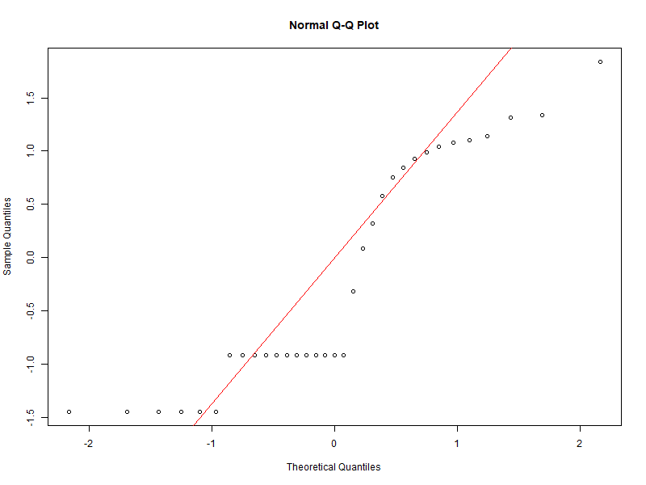
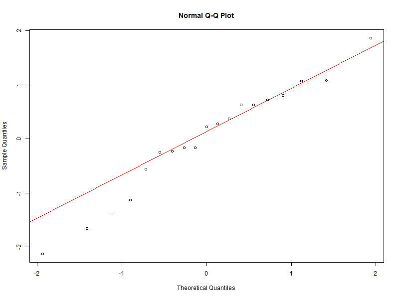

# **R command lines and script**

We analyzed data from 175 wild sloths captured between 1994 and 1995 during the flooding of the Petit Saut Dam (5°03′43″ N, 53°03′00″ O) on the Sinnamary River (French Guiana, South America). The clinical data include the following variables for each examined sloth: 
- `species` : Sloth species (Bt: *Bradypus tridactylus*; Cd: *Choloepus didactylus*)
- `sex` : Sex of the sloth (F: Female; M: Male)
- `age_class` : Age category (A: Adult; J: Juvenile)
- `season` : Season of capture (W: Wet; D: Dry)
- `weight` : Body weight (quantitative variable, in kg)
- `total_length` : Total body length (quantitative variable, in cm)
- `wither_height` : Height at the withers (quantitative variable, in cm)
- `neck_size` : Neck circumference (quantitative variable, in cm)
- `temperature` : Body temperature (quantitative variable, in °C)
- `hematocrit` : Hematocrit level (quantitative variable, in %)
- `health_condition` : Overall health status (G: Good; D: Deteriorated)
- `anaplasma` : Infection status with *Anaplasma* (0: Uninfected; 1: Infected)
- `tick` : Presence of ticks in the fur (0: Absent; 1: Present)
- `microfilaria` : Infection status with microfilariae (0: Uninfected; 1: Infected)
- `trypanosome` : Infection status with trypanosomes (0: Uninfected; 1: Infected)
- `babesia` : Infection status with _Babesia_ (0: Uninfected; 1: Infected)
- `bloodparasite` : Combined infection status for blood parasites (microfilariae + trypanosome + _Babesia_, but excluding _Anaplasma_; 0: Uninfected; 1: Infected)
  
Details about all the experimental methods and measures are available in the related manuscript.


## Table of contents 
- [Step 1. Retrieving the data](#step-1-retrieving-the-data)
- [Step 2. Prepare the data for analysis](#step-2-prepare-the-data-for-analysis)
- [Step 3. Calculate *Anaplasma* infection prevalence](#step-3-calculate-anaplasma-infection-prevalence)
- [Step 4. Test whether _Anaplasma_ infection prevalence in _Bradypus tridactylus_ (Bt) is influenced by sex, age, season, ticks and blood parasites (GLM model 1)](#step-4-test-whether-anaplasma-infection-prevalence-in-bradypus-tridactylus-bt-is-influenced-by-sex-age-season-ticks-and-blood-parasites-glm-model-1)
- [Step 5. Test whether _Anaplasma_ infection prevalence in _Choloepus didactylus_ (Cd) is influenced by sex, age, season, ticks and blood parasites (GLM model 2)](#step-5-test-whether-anaplasma-infection-prevalence-in-choloepus-didactylus-cd-is-influenced-by-sex-age-season-ticks-and-blood-parasites-glm-model-2)
- [Step 6. Test whether the proportion of sloths carrying ticks and blood parasites vary between seasons](#step-6-test-whether-the-proportion-of-sloths-carrying-ticks-and-blood-parasites-vary-between-seasons)
- [Step 7. Impact of _Anaplasma_ infections on Scale Mass Index (SMI) (GLM models 3 and 4)](#step-7-impact-of-anaplasma-infections-on-scale-mass-index-smi-glm-models-3-and-4)
- [Step 8. Impact of _Anaplasma_ infections on neck circumference (GLM models 5 and 6)](#step-8-impact-of-anaplasma-infections-on-neck-circumference-glm-models-5-and-6)
- [Step 9. Impact of _Anaplasma_ infections on hematocrit levels (GLM models 7, 8 and 9)](#step-9-impact-of-anaplasma-infections-on-hematocrit-levels-glm-models-7-8-and-9)
- [Step 10. Impact of _Anaplasma_ infections on body temperature (CLRM models 10 and 11)](#step-10-impact-of-anaplasma-infections-on-body-temperature-clrm-models-10-and-11)
- [Step 11. Impact of _Anaplasma_ infections on general health condition](#step-11-impact-of-anaplasma-infections-on-general-health-condition)
- [Step 12. Impact of _Anaplasma_ infections on female reproductive status](#step-12-impact-of-anaplasma-infections-on-female-reproductive-status)

## Step 1. Retrieving the data

All veterinary clinical data for the two sloth species are available here: https://github.com/olivierduron/Anaplasma_sloth_infections/blob/main/data_sloth.csv

This database will be referred to as `data_sloth` throughout the R command lines and scripts provided below. It corresponds to the dataset provided in Table S1 of the related manuscript.

Load the dataset directly from the GitHub repository to R:
```
data_sloth <- read.csv("https://raw.githubusercontent.com/olivierduron/Anaplasma_sloth_infections/main/data_sloth.csv", sep="\t")
```


## Step 2. Prepare the data for analysis

Convert categorical variables into factors:
```
data_sloth$anaplasma      <- as.factor(data_sloth$anaplasma)
data_sloth$species        <- as.factor(data_sloth$species)
data_sloth$season         <- as.factor(data_sloth$season)
data_sloth$sex            <- as.factor(data_sloth$sex)
data_sloth$age            <- as.factor(data_sloth$age)
data_sloth$tick           <- as.factor(data_sloth$tick)
data_sloth$microfilaria   <- as.factor(data_sloth$microfilaria)
data_sloth$trypanosome    <- as.factor(data_sloth$trypanosome)
data_sloth$babesia        <- as.factor(data_sloth$babesia)
data_sloth$bloodparasite  <- as.factor(data_sloth$bloodparasite)
```

Load libraries for analysis: 
```
library(binom)
library(dplyr)
library(MASS)
library(ggplot2)
library(patchwork)
library(smatr)
library(lmtest)
library(akima)
library(pwr)
library(survival)
library(RColorBrewer)
```

## Step 3. Calculate *Anaplasma* infection prevalence
Calculate _Anaplasma_ infection prevalence and 95% confidence interval for _Bradypus tridactylus_ (Bt) and _Choloepus didactylus_ (Cd):

```
prevalence_results <- data_sloth %>% group_by(species) %>% summarise(n = n(), positives = sum(anaplasma == 1), prevalence = positives / n, conf_low = binom.confint(positives, n, conf.level = 0.95, methods = "exact")$lower, conf_high = binom.confint(positives, n, conf.level = 0.95, methods = "exact")$upper)
print(prevalence_results)
```

Results are:
```
# A tibble: 2 × 6
  species     n positives prevalence conf_low conf_high
  <fct>   <int>     <int>      <dbl>    <dbl>     <dbl>
1 Bt         92        58      0.630    0.523     0.729
2 Cd         83        40      0.482    0.371     0.594
```

Test if `anaplasma` is influenced by sloth `species`:
```
chisq.test(table(data_sloth$anaplasma, data_sloth$species))
```

Results are:
```
Pearson's Chi-squared test with Yates' continuity correction
data:  table(data_sloth$anaplasma, data_sloth$species)
X-squared = 3.3261, df = 1, p-value = 0.06819
```

## Step 4. Test whether _Anaplasma_ infection prevalence in _Bradypus tridactylus_ (Bt) is influenced by sex, age, season, ticks and blood parasites (GLM model 1)
Create a subset `data_Bt` containing only records for _Bradypus tridactylus_ (Bt):

```
data_Bt <- subset(data_sloth, species == "Bt")
```

Fit a GLM to test whether `anaplasma` is influenced by interactions among `sex`, `age`, `season`, `tick`, and `bloodparasite` in Bt:
```
model_1 <- glm(anaplasma ~ sex * age * season * tick * bloodparasite, data = data_Bt, family = binomial)
```

Fit a GLM to test whether `anaplasma` infection prevalence is influenced by additive effects of `sex`, `age`, `season`, `tick`, and `bloodparasite` in Bt:
```
model_1a <- glm(anaplasma ~ sex + age + season + tick + bloodparasite, data = data_Bt, family = binomial)
```

Compare the additive model (model_1a) to the interaction model (model_1) using a likelihood ratio test:
```
anova(model_1a, model_1, test = "Chisq")
```

Results are:
```
Analysis of Deviance Table
Model 1: anaplasma ~ sex + age + season + tick + bloodparasite
Model 2: anaplasma ~ sex * age * season * tick * bloodparasite
  Resid. Df Resid. Dev Df Deviance Pr(>Chi)
1        86     116.73                     
2        74     100.33 12   16.409   0.1732
```

Compute AIC for both models to evaluate model fit:
```
AIC(model_1, model_1a)
```

Results are:
```
         df      AIC
model_1  18 136.3264
model_1a  6 128.7350
```

Perform drop-one-term analysis on the additive model:
```
res <- drop1(model_1a, test = "Chisq")
```

Results are:
```
Single term deletions
Model: anaplasma ~ sex + age + season + tick + bloodparasite
              Df Deviance    AIC     LRT Pr(>Chi)
<none>             116.73 128.74                 
sex            1   119.39 129.40 2.65956   0.1029
age            1   118.01 128.01 1.27259   0.2593
season         1   116.93 126.93 0.19048   0.6625
tick           1   117.56 127.56 0.82359   0.3641
bloodparasite  1   116.74 126.74 0.00537   0.9416
```

Calculate delta AIC for each term to assess its contribution to model fit:
```
aic_full <- AIC(model_1a)
res$delta_AIC <- res$AIC - aic_full
print(res[, c("AIC", "delta_AIC")])
```

Results are:
```
                 AIC delta_AIC
<none>        128.74   0.00000
sex           129.40   0.65956
age           128.01   0.72741
season        126.93   1.80952
tick          127.56   1.17641
bloodparasite 126.74   1.99463
```

Compare the null model (model_null) to univariate models using likelihood ratio tests and AIC:
```
model_null <- glm(anaplasma ~ 1, data = data_Bt, family = binomial)
model_sex <- glm(anaplasma ~ sex, data = data_Bt, family = binomial)
model_age <- glm(anaplasma ~ age, data = data_Bt, family = binomial)
model_season <- glm(anaplasma ~ season, data = data_Bt, family = binomial)
model_tick <- glm(anaplasma ~ tick, data = data_Bt, family = binomial)
model_bloodparasite <- glm(anaplasma ~ bloodparasite, data = data_Bt, family = binomial)
anova(model_null, model_sex, test="Chisq")
anova(model_null, model_age, test="Chisq")
anova(model_null, model_season, test="Chisq")
anova(model_null, model_tick, test="Chisq")
anova(model_null, model_bloodparasite, test="Chisq")
aics <- AIC(model_null, model_sex, model_age, model_season, model_tick, model_bloodparasite)
aic_null <- aics["model_null", "AIC"]
aics$delta_AIC_vs_null <- aics$AIC - aic_null
print(aics[, c("AIC", "delta_AIC_vs_null")])
```

Results are:
```
Analysis of Deviance Table
Model 1: anaplasma ~ 1
Model 2: anaplasma ~ sex
  Resid. Df Resid. Dev Df Deviance Pr(>Chi)
1        91     121.20                     
2        90     119.39  1   1.8129   0.1782
---
Analysis of Deviance Table
Model 1: anaplasma ~ 1
Model 2: anaplasma ~ age
  Resid. Df Resid. Dev Df Deviance Pr(>Chi)
1        91     121.20                     
2        90     120.05  1   1.1537   0.2828
---
Analysis of Deviance Table
Model 1: anaplasma ~ 1
Model 2: anaplasma ~ season
  Resid. Df Resid. Dev Df Deviance Pr(>Chi)
1        91      121.2                     
2        90      120.8  1  0.41002    0.522
---
Analysis of Deviance Table
Model 1: anaplasma ~ 1
Model 2: anaplasma ~ tick
  Resid. Df Resid. Dev Df Deviance Pr(>Chi)
1        91     121.20                     
2        90     120.67  1  0.53727   0.4636
---
Analysis of Deviance Table
Model 1: anaplasma ~ 1
Model 2: anaplasma ~ bloodparasite
  Resid. Df Resid. Dev Df Deviance Pr(>Chi)
1        91     121.20                     
2        90     121.17  1 0.037782   0.8459
---
                         AIC delta_AIC_vs_null
model_null          123.2052         0.0000000
model_sex           123.3923         0.1871191
model_age           124.0515         0.8463400
model_season        124.7952         1.5899764
model_tick          124.6679         1.4627279
model_bloodparasite 125.1674         1.9622180
```

Tests for associations between `anaplasma` and the presence of blood parasites (`microfilaria`, `trypanosome`, `babesia`) considered separately in Bt:
```
fisher.test(table(data_Bt$anaplasma, data_Bt$microfilaria))  
fisher.test(table(data_Bt$anaplasma, data_Bt$trypanosome))  
fisher.test(table(data_Bt$anaplasma, data_Bt$babesia))
```

Results are:
```
Fisher's Exact Test for Count Data
data:  table(data_Bt$anaplasma, data_Bt$microfilaria)
p-value = 0.8227
alternative hypothesis: true odds ratio is not equal to 1
95 percent confidence interval:
0.3362994 2.4250879
sample estimates:
odds ratio 
0.894268 

data:  table(data_Bt$anaplasma, data_Bt$trypanosome)
p-value = 0.9999
alternative hypothesis: true odds ratio is not equal to 1
95 percent confidence interval:
0.0591107 71.5824945
sample estimates:
odds ratio 
1.176551 

data:  table(data_Bt$anaplasma, data_Bt$babesia)
p-value = 0.9999
alternative hypothesis: true odds ratio is not equal to 1
95 percent confidence interval:
0 Inf
sample estimates:
odds ratio 
0
```

## Step 5. Test whether _Anaplasma_ infection prevalence in _Choloepus didactylus_ (Cd) is influenced by sex, age, season, ticks and blood parasites (GLM model 2)

Create a subset `data_Cd` containing only records for _Choloepus didactylus_ (Cd):
```
data_Cd <- subset(data_sloth, species == "Cd")
```

Fit a GLM to test whether `anaplasma` is influenced by interactions among `sex`, `age`, `season`, `tick`, and `bloodparasite` in Cd:
```
model_2 <- glm(anaplasma ~ sex * age * season * tick * bloodparasite, data = data_Cd, family = binomial)
```

Fit a GLM to test whether `anaplasma` infection prevalence is influenced by additive effects of `sex`, `age`, `season`, `tick`, and `bloodparasite` in Cd:
```
model_2a <- glm(anaplasma ~ sex + age + season + tick + bloodparasite, data = data_Cd, family = binomial)
```

Compare the additive model (model_2a) to the interaction model (model_2) using a likelihood ratio test:
```
anova(model_2a, model_2, test = "Chisq")
```

Results are:
```
Analysis of Deviance Table
Model 1: anaplasma ~ sex + age + season + tick + bloodparasite
Model 2: anaplasma ~ sex * age * season * tick * bloodparasite
  Resid. Df Resid. Dev Df Deviance Pr(>Chi)
1        77    106.525                     
2        61     85.459 16   21.066    0.176
```

Compute AIC for both models to evaluate model fit:
```
AIC(model_2, model_2a)
```

Results are:
```
         df      AIC
model_2  22 129.4592
model_2a  6 118.5250
```

Perform drop-one-term analysis on the additive model:
```
res <- drop1(model_2a, test = "Chisq")
```

Results are:
```
Single term deletions
Model:
anaplasma ~ sex + age + season + tick + bloodparasite
              Df Deviance    AIC     LRT Pr(>Chi)  
<none>             106.53 118.53                   
sex            1   107.12 117.12 0.59812  0.43930  
age            1   108.07 118.07 1.54781  0.21346  
season         1   107.82 117.82 1.29158  0.25576  
tick           1   109.35 119.35 2.82844  0.09261
bloodparasite  1   107.03 117.03 0.50223  0.47852  
```

Calculate delta AIC for each term to assess its contribution to model fit:
```
aic_full <- AIC(model_2a)
res$delta_AIC <- res$AIC - aic_full
print(res[, c("AIC", "delta_AIC")])
```

Results are:
```
                 AIC delta_AIC
<none>        118.53   0.00000
sex           117.12   1.40188
age           118.07   0.45219
season        117.82   0.70842
tick          119.35   0.82844
bloodparasite 117.03   1.49777
```

Compare the null model (model2_null) to univariate models using likelihood ratio tests and AIC:
```
model2_null <- glm(anaplasma ~ 1, data = data_Cd, family = binomial)
model2_sex <- glm(anaplasma ~ sex, data = data_Cd, family = binomial)
model2_age <- glm(anaplasma ~ age, data = data_Cd, family = binomial)
model2_season <- glm(anaplasma ~ season, data = data_Cd, family = binomial)
model2_tick <- glm(anaplasma ~ tick, data = data_Cd, family = binomial)
model2_bloodparasite <- glm(anaplasma ~ bloodparasite, data = data_Cd, family = binomial)
anova(model2_null, model2_sex, test="Chisq")
anova(model2_null, model2_age, test="Chisq")
anova(model2_null, model2_season, test="Chisq")
anova(model2_null, model2_tick, test="Chisq")
anova(model2_null, model2_bloodparasite, test="Chisq")
aics <- AIC(model2_null, model2_sex, model2_age, model2_season, model2_tick, model2_bloodparasite)
aic_null <- aics["model2_null", "AIC"]
aics$delta_AIC_vs_null <- aics$AIC - aic_null
print(aics[, c("AIC", "delta_AIC_vs_null")])
```

Results are:
```
Analysis of Deviance Table
Model 1: anaplasma ~ 1
Model 2: anaplasma ~ sex
  Resid. Df Resid. Dev Df Deviance Pr(>Chi)
1        82     114.95                     
2        81     113.59  1   1.3666   0.2424
---
Analysis of Deviance Table
Model 1: anaplasma ~ 1
Model 2: anaplasma ~ age
  Resid. Df Resid. Dev Df Deviance Pr(>Chi)
1        82     114.95                     
2        81     114.05  1  0.90314   0.3419
---
Analysis of Deviance Table
Model 1: anaplasma ~ 1
Model 2: anaplasma ~ season
  Resid. Df Resid. Dev Df Deviance Pr(>Chi)  
1        82     114.95                       
2        81     112.07  1   2.8815   0.0896
---
Analysis of Deviance Table
Model 1: anaplasma ~ 1
Model 2: anaplasma ~ tick
  Resid. Df Resid. Dev Df Deviance Pr(>Chi)  
1        82     114.95                       
2        81     110.85  1   4.1012  0.04285 *
---
Analysis of Deviance Table
Model 1: anaplasma ~ 1
Model 2: anaplasma ~ bloodparasite
  Resid. Df Resid. Dev Df Deviance Pr(>Chi)
1        82     114.95                     
2        81     114.05  1  0.90314   0.3419
---
                          AIC delta_AIC_vs_null
model2_null          116.9540         0.0000000
model2_sex           117.5873         0.6333481
model2_age           118.0508         1.0968613
model2_season        116.0724         0.8815494
model2_tick          114.8528         2.1011720
model2_bloodparasite 118.0508         1.0968613
```

Display the proportion of Cd sloths infected by Anaplasma with and without ticks:
```
table_anaplasma_tick_Cd <- table(data_Cd$anaplasma, data_Cd$tick)
table_anaplasma_tick_Cd
```

Tests for associations between `anaplasma` and the presence of blood parasites (`microfilaria`, `trypanosome`, `babesia`) considered separately in Cd:
```
fisher.test(table(data_Cd$anaplasma, data_Cd$microfilaria))  
fisher.test(table(data_Cd$anaplasma, data_Cd$trypanosome))  
fisher.test(table(data_Cd$anaplasma, data_Cd$babesia))
```

Results are:
```
Fisher's Exact Test for Count Data
data:  table(data_Cd$anaplasma, data_Cd$microfilaria)
p-value = 0.9999
alternative hypothesis: true odds ratio is not equal to 1
95 percent confidence interval:
0.2272016 3.5201430
sample estimates:
odds ratio 
0.9086257 

data:  table(data_Cd$anaplasma, data_Cd$trypanosome)
p-value = 0.2292
alternative hypothesis: true odds ratio is not equal to 1
95 percent confidence interval:
0.2028662       Inf
sample estimates:
odds ratio 
Inf 

data:  table(data_Cd$anaplasma, data_Cd$babesia)
p-value = 0.2538
alternative hypothesis: true odds ratio is not equal to 1
95 percent confidence interval:
0.4399427 32.1559681
sample estimates:
odds ratio 
2.892291 
```

## Step 6. Test whether the proportion of sloths carrying ticks and blood parasites vary between seasons
Test whether the proportion of sloths carrying `tick` and `bloodparasite` differs across `season` in Bt:
```
chisq.test(table(data_Bt$tick, data_Bt$season))
chisq.test(table(data_Bt$season, data_Bt$bloodparasite))
```

Results are:
```
Pearson's Chi-squared test with Yates' continuity correction
data:  table(data_Bt$tick, data_Bt$season)
X-squared = 4.1762e-31, df = 1, p-value = 1

data:  table(data_Bt$season, data_Bt$bloodparasite)
X-squared = 0.74957, df = 1, p-value = 0.3866
```

Test whether the proportion of sloths carrying `tick` and `bloodparasite` differs across `season` in Cd:
```
chisq.test(table(data_Cd$season, data_Cd$bloodparasite))  
chisq.test(table(data_Cd$tick, data_Cd$season))
```

Results are:
```
Pearson's Chi-squared test with Yates' continuity correction
data:  table(data_Cd$season, data_Cd$bloodparasite)
X-squared = 2.8165, df = 1, p-value = 0.0933

data:  table(data_Cd$tick, data_Cd$season)
X-squared = 4.204, df = 1, p-value = 0.04033
```

Display the proportion of Cd sloths infested with `tick` across different `season`
```
table_tick_season_Cd <- table(data_Cd$tick, data_Cd$season)
table_tick_season_Cd
```

## Step 7. Impact of _Anaplasma_ infections on Scale Mass Index (SMI) (GLM models 3 and 4)
The Scaled Mass Index (SMI) was used as a body condition indicator that standardizes individual `weight` to `body_length`, using an allometric scaling relationship. SMI was calculated following Peig & Green (2009) (https://doi.org/10.1111/j.1600-0706.2009.17643.x).

Function to calculate SMI for adult Bt:
```
data_adult_Bt <- subset(data_Bt, age == "A")
sma_model_Bt <- sma(log(weight) ~ log(total_length), data = data_adult_Bt)
b <- coef(sma_model_Bt)[2]
L0 <- mean(data_adult_Bt$total_length, na.rm = TRUE)
data_adult_Bt$SMI <- data_adult_Bt$weight * (L0 / data_adult_Bt$total_length)^b
```

Fit a GLM to test whether SMI is influenced by interactions among `anaplasma`, `sex`, and `season` in Bt:
```
model_3 <- glm(SMI ~ anaplasma * season * sex, data = data_adult_Bt, family = gaussian(link = "identity"))
```

Fit a GLM to test whether SMI is influenced by additive effects of `anaplasma`, `sex`, and `season` in Bt:
```
model_3a <- glm(SMI ~ anaplasma + season + sex, data = data_adult_Bt, family = gaussian(link = "identity"))
```

Compare the additive model (model_3a) to the interaction model (model_3) using a likelihood ratio test:
```
anova(model_3a, model_3, test = "Chisq")
```

Results are:
```
Analysis of Deviance Table
Model 1: SMI ~ anaplasma + season + sex
Model 2: SMI ~ anaplasma * season * sex
  Resid. Df Resid. Dev Df Deviance Pr(>Chi)
1        79     26.429                     
2        75     24.043  4   2.3861   0.1142
```

Compute AIC for both models to evaluate model fit:
```
AIC(model_3, model_3a)
```

Results are:
```
         df      AIC
model_3   9 150.7068
model_3a  5 150.5604
```

Perform drop-one-term analysis on the additive model:
```
res <- drop1(model_3a, test = "Chisq")
```

Results are:
```
Single term deletions
Model:
SMI ~ anaplasma + season + sex
          Df Deviance    AIC scaled dev.  Pr(>Chi)    
<none>         26.429 150.56                          
anaplasma  1   26.855 149.89      1.3271 0.2493206    
season     1   26.453 148.64      0.0770 0.7814389    
sex        1   30.723 161.06     12.4943 0.0004082 ***  
```

Calculate delta AIC for each term to assess its contribution to model fit:
```
aic_full <- AIC(model_3a)
res$delta_AIC <- res$AIC - aic_full
print(res[, c("AIC", "delta_AIC")])
```

Results are:
```
             AIC delta_AIC
<none>    150.56    0.0000
anaplasma 149.89    0.6729
season    148.64    1.9230
sex       161.06   10.4943
```

Fit a linear model to test the effect of `sex` on SMI in adult Bt and assess model fit, residual normality, and heteroscedasticity:
```
model_3b <- glm(SMI ~ sex, data = data_adult_Bt, family = gaussian(link = "identity"))
anova(model_3b, model_3, test = "Chisq")
AIC(model_3b, model_3)
shapiro.test(model_3b$residuals)
bptest(model_3b)
```

Results are:
```
> anova(model_3b, model_3, test = "Chisq")
Analysis of Deviance Table
Model 1: SMI ~ sex
Model 2: SMI ~ anaplasma * season * sex
  Resid. Df Resid. Dev Df Deviance Pr(>Chi)
1        81     26.881                     
2        75     24.043  6   2.8382    0.182

> AIC(model_3b, model_3)
         df      AIC
model_3b  3 147.9681
model_3   9 150.7068

> shapiro.test(model_3b$residuals)
Shapiro-Wilk normality test
data:  model_3b$residuals
W = 0.99063, p-value = 0.8169

> bptest(model_3b)
studentized Breusch-Pagan test
data:  model_3b
BP = 2.7945, df = 1, p-value = 0.09459
```

Calculation of mean and standard error of SMI by `sex` for Bt:
```
data_adult_Bt %>%
  group_by(sex) %>%
  summarise(
    mean_SMI = mean(SMI, na.rm = TRUE),
    se_SMI = sd(SMI, na.rm = TRUE) / sqrt(sum(!is.na(SMI))))
```

Results are:
```
A tibble: 2 × 3
  sex   mean_SMI se_SMI
  <fct>    <dbl>  <dbl>
1 F         4.39 0.0772
2 M         4.83 0.0997
```

Post hoc power analyses for SMI tests in Bt:
```
n <- nrow(na.omit(data_adult_Bt[, c("SMI", "anaplasma", "season", "sex")]))
k <- 7
pwr.f2.test(u = k, v = n - k - 1, f2 = 0.30, sig.level = 0.05)
pwr.f2.test(u = k, v = n - k - 1, f2 = 0.20, sig.level = 0.05)
```

Results are:
```
Multiple regression power calculation (f2 = 0.30)
u = 7
v = 75
f2 = 0.3
sig.level = 0.05
power = 0.9580486
and
Multiple regression power calculation (f2 = 0.20)
u = 7
v = 75
f2 = 0.2
sig.level = 0.05
power = 0.824756
```

Generate SMI chart for Bt:
```
clean_data <- data_adult_Bt %>%
  filter(
    !is.na(weight), !is.na(total_length), !is.na(SMI),
    is.finite(weight), is.finite(total_length), is.finite(SMI)
  ) %>%
  mutate(
    sex_infect = case_when(
      sex == "M" & anaplasma == 0 ~ "Male, uninfected",
      sex == "M" & anaplasma == 1 ~ "Male, infected",
      sex == "F" & anaplasma == 0 ~ "Female, uninfected",
      sex == "F" & anaplasma == 1 ~ "Female, infected",
      TRUE ~ NA_character_
    )
  )
levels_order <- c("Male, uninfected", "Male, infected", "Female, uninfected", "Female, infected")
clean_data <- clean_data %>%
  mutate(
    sex_infect = factor(sex_infect, levels = levels_order),
    point_size = case_when(
      sex_infect %in% c("Male, uninfected", "Male, infected") ~ 3.25,
      TRUE ~ 4  # taille normale pour les cercles
    )
  )
interp_data <- with(clean_data, akima::interp(
  x = weight,
  y = total_length,
  z = SMI,
  duplicate = "mean",
  extrap = FALSE
))
interp_df <- expand.grid(
  x = interp_data$x,
  y = interp_data$y
)
interp_df$z <- as.vector(interp_data$z)
legend_point_sizes <- c(3.25, 3.25, 4, 4) / 2
ggplot() +
  geom_contour_filled(data = interp_df, aes(x = x, y = y, z = z)) +
  geom_point(
    data = clean_data,
    aes(
      x = weight,
      y = total_length,
      shape = sex_infect,
      size = point_size
    ),
    color = "black",
    stroke = 1
  ) +
  scale_fill_brewer(palette = "Green", name = "SMI level") +
  scale_shape_manual(
    name = expression(paste(italic("Anaplasma"), " infection status")),
    values = c(
      "Male, uninfected" = 0,
      "Male, infected" = 12,
      "Female, uninfected" = 1,
      "Female, infected" = 10
    )
  ) +
  scale_size_identity(guide = "none") + 
  guides(
    shape = guide_legend(override.aes = list(size = legend_point_sizes))
  ) +
  labs(
    x = "Body mass (kg)",
    y = "Total Length (cm)",
    title = expression(paste("Scale Mass Index (SMI) of ", italic("Bradypus tridactylus")))
  ) +
  theme_minimal(base_size = 14) +
  theme(
    legend.position = "right",
    panel.border = element_rect(color = "black", fill = NA, size = 1),
    panel.background = element_blank(),
    axis.title = element_text(size = 16),
    axis.text = element_text(size = 14)
  )
```

Function to calculate SMI for adult Cd:
```
data_adult_Cd <- subset(data_Cd, age == "A")
sma_model_Cd <- sma(log(weight) ~ log(total_length), data = data_adult_Cd)
b <- coef(sma_model_Cd)[2]
L0 <- mean(data_adult_Cd$total_length, na.rm = TRUE)
data_adult_Cd$SMI <- data_adult_Cd$weight * (L0 / data_adult_Cd$total_length)^b
```

Fit a GLM to test whether SMI is influenced by interactions among `anaplasma`, `sex`, and `season` in Cd:
```
model_4 <- glm(SMI ~ anaplasma * season * sex, data = data_adult_Cd, family = gaussian(link = "identity"))
```

Fit a GLM to test whether SMI is influenced by additive effects of `anaplasma`, `sex`, and `season` in Cd:
```
model_4a <- glm(SMI ~ anaplasma + season + sex, data = data_adult_Cd, family = gaussian(link = "identity"))
```

Compare the additive model (model_4a) to the interaction model (model_4) using a likelihood ratio test:
```
anova(model_4a, model_4, test = "Chisq")
```

Results are:
```
Analysis of Deviance Table
Model 1: SMI ~ anaplasma + season + sex
Model 2: SMI ~ anaplasma * season * sex
  Resid. Df Resid. Dev Df Deviance Pr(>Chi)
1        53     29.714                     
2        49     28.308  4   1.4066   0.6564
```

Compute AIC for both models to evaluate model fit:
```
AIC(model_4, model_4a)
```

Results are:
```
         df      AIC
model_4   9 139.8637
model_4a  5 134.6278
```

Perform drop-one-term analysis on the additive model:
```
res <- drop1(model_4a, test = "Chisq")
```

Results are:
```
Single term deletions
Model: SMI ~ anaplasma + season + sex
          Df Deviance    AIC scaled dev. Pr(>Chi)
<none>         29.714 134.63                     
anaplasma  1   30.415 133.96     1.32866   0.2490
season     1   29.998 133.17     0.54260   0.4614
sex        1   29.737 132.67     0.04287   0.8360 
```

Calculate delta AIC for each term to assess its contribution to model fit:
```
aic_full <- AIC(model_4a)
res$delta_AIC <- res$AIC - aic_full
print(res[, c("AIC", "delta_AIC")])
```

Results are:
```
             AIC delta_AIC
<none>    134.63   0.00000
anaplasma 133.96   0.67134
season    133.17   1.45740
sex       132.67   1.95713
```

Fit a linear model to test the null hypothesis (SMI ~ 1) in adult Bt, assessing model fit and checking residual normality:
```
model_4b <- glm(SMI ~ 1, data = data_adult_Cd, family = gaussian(link = "identity"))
anova(model_4b, model_4, test = "Chisq")
AIC(model_4b, model_4)
shapiro.test(model_4b$residuals)
```

Results are:
```
> anova(model_4b, model_4, test = "Chisq")
Analysis of Deviance Table
Model 1: SMI ~ 1
Model 2: SMI ~ anaplasma * season * sex
  Resid. Df Resid. Dev Df Deviance Pr(>Chi)
1        56     30.572                     
2        49     28.308  7    2.264   0.7891

> AIC(model_4b, model_4)
         df      AIC
model_4b  2 130.2494
model_4   9 139.8637

> shapiro.test(model_4b$residuals)
Shapiro-Wilk normality test
data:  model_4b$residuals
W = 0.97913, p-value = 0.4275
```

Post hoc power analyses for SMI tests in Cd:
```
n <- nrow(na.omit(data_adult_Cd[, c("SMI", "anaplasma", "season", "sex")]))
k <- 7
pwr.f2.test(u = k, v = n - k - 1, f2 = 0.30, sig.level = 0.05)
pwr.f2.test(u = k, v = n - k - 1, f2 = 0.20, sig.level = 0.05)
```

Results are:
```
Multiple regression power calculation (f2 = 0.30)
u = 7
v = 49
f2 = 0.3
sig.level = 0.05
power = 0.8166297
and
Multiple regression power calculation (f2 = 0.20)
u = 7
v = 49
f2 = 0.2
sig.level = 0.05
power = 0.6102676
```

Generate SMI chart for Cd:
```
clean_data <- data_adult_Cd %>%
  filter(
    !is.na(weight), !is.na(total_length), !is.na(SMI),
    is.finite(weight), is.finite(total_length), is.finite(SMI)
  ) %>%
  mutate(
    sex_infect = case_when(
      sex == "M" & anaplasma == 0 ~ "Male, uninfected",
      sex == "M" & anaplasma == 1 ~ "Male, infected",
      sex == "F" & anaplasma == 0 ~ "Female, uninfected",
      sex == "F" & anaplasma == 1 ~ "Female, infected",
      TRUE ~ NA_character_
    )
  )
levels_order <- c("Male, uninfected", "Male, infected", "Female, uninfected", "Female, infected")
clean_data <- clean_data %>%
  mutate(
    sex_infect = factor(sex_infect, levels = levels_order),
    point_size = case_when(
      sex_infect %in% c("Male, uninfected", "Male, infected") ~ 3.25,
      TRUE ~ 4  # taille normale pour les cercles
    )
  )
interp_data <- with(clean_data, akima::interp(
  x = weight,
  y = total_length,
  z = SMI,
  duplicate = "mean",
  extrap = FALSE
))
interp_df <- expand.grid(
  x = interp_data$x,
  y = interp_data$y
)
interp_df$z <- as.vector(interp_data$z)
legend_point_sizes <- c(3.25, 3.25, 4, 4) / 2
ggplot() +
  geom_contour_filled(data = interp_df, aes(x = x, y = y, z = z)) +
  geom_point(
    data = clean_data,
    aes(
      x = weight,
      y = total_length,
      shape = sex_infect,
      size = point_size
    ),
    color = "black",
    stroke = 1
  ) +
  scale_fill_brewer(palette = "YlOrBr", name = "SMI level") +
  scale_shape_manual(
    name = expression(paste(italic("Anaplasma"), " infection status")),
    values = c(
      "Male, uninfected" = 0,
      "Male, infected" = 12,
      "Female, uninfected" = 1,
      "Female, infected" = 10
    )
  ) +
  scale_size_identity(guide = "none") + 
  guides(
    shape = guide_legend(override.aes = list(size = legend_point_sizes))
  ) +
  labs(
    x = "Body mass (kg)",
    y = "Total Length (cm)",
    title = expression(paste("Scale Mass Index (SMI) of ", italic("Choloepus didactylus")))
  ) +
  theme_minimal(base_size = 14) +
  theme(
    legend.position = "right",
    panel.border = element_rect(color = "black", fill = NA, size = 1),
    panel.background = element_blank(),
    axis.title = element_text(size = 16),
    axis.text = element_text(size = 14)
  )
```

## Step 8. Impact of _Anaplasma_ infections on neck circumference (GLM models 5 and 6)

Fit a GLM to test whether neck circumference is influenced by interactions among `anaplasma`, `sex`, and `season` in Bt:
```
model_5 <- glm(log(neck_size) ~ anaplasma * season * sex, data = data_adult_Bt, family = gaussian(link = "identity"))
```

Fit a GLM to test whether SMI is influenced by additive effects of `anaplasma`, `sex`, and `season` in Bt:
```
model_5a <- glm(log(neck_size) ~ anaplasma + season + sex, data = data_adult_Bt, family = gaussian(link = "identity"))
```

Compare the additive model (model_5a) to the interaction model (model_5) using a likelihood ratio test:
```
anova(model_5a, model_5, test = "Chisq")
```

Results are:
```
Analysis of Deviance Table
Model 1: log(neck_size) ~ anaplasma + season + sex
Model 2: log(neck_size) ~ anaplasma * season * sex
  Resid. Df Resid. Dev Df Deviance Pr(>Chi)
1        57    0.49104                     
2        53    0.48101  4 0.010032   0.8934
```

Compute AIC for both models to evaluate model fit:
```
AIC(model_5, model_5a)
```

Results are:
```
         df       AIC
model_5   9  104.2969
model_5a  5  111.0378
```


Perform drop-one-term analysis on the additive model:
```
res <- drop1(model_5a, test = "Chisq")
```

Results are:
```
Single term deletions
Model:
log(neck_size) ~ anaplasma + season + sex
          Df Deviance     AIC scaled dev. Pr(>Chi)  
<none>        0.49104  111.04                       
anaplasma  1  0.49589  112.44     0.59895  0.43898  
season     1  0.49389  112.69     0.35268  0.55260  
sex        1  0.51549  110.07     2.96411  0.08513
```

Calculate delta AIC for each term to assess its contribution to model fit:
```
aic_full <- AIC(model_5a)
res$delta_AIC <- res$AIC - aic_full
print(res[, c("AIC", "delta_AIC")])
```

Results are:
```
              AIC delta_AIC
<none>     111.04   0.00000
anaplasma  112.44   1.40105
season     112.69   1.64732
sex        110.07   0.96411
```

Fit a linear model to test the null hypothesis (`neck_size` ~ 1) in adult Bt, assessing model fit and checking residual normality:
```
model_5b <- glm(log(neck_size) ~ 1, data = data_adult_Bt, family = gaussian(link = "identity"))
anova(model_5b, model_5, test = "Chisq")
AIC(model_5b, model_5)
shapiro.test(model_5b$residuals)
```

Results are:
```
> anova(model_5b, model_5, test = "Chisq")
Analysis of Deviance Table
Model 1: log(neck_size) ~ 1
Model 2: log(neck_size) ~ anaplasma * season * sex
  Resid. Df Resid. Dev Df Deviance Pr(>Chi)
1        60    0.52778                     
2        53    0.48101  7 0.046776   0.6412

> AIC(model_5b, model_5)
         df       AIC
model_5b  2  112.6360
model_5   9  104.2969

> shapiro.test(model_5b$residuals)
Shapiro-Wilk normality test
data:  model_5b$residuals
W = 0.96651, p-value = 0.09328
```

Fit a GLM to test whether neck circumference is influenced by interactions among `anaplasma`, `sex`, and `season` in Cd:
```
model_6 <- glm(log(neck_size) ~ anaplasma * season * sex, data = data_adult_Cd, family = gaussian(link = "identity"))
```

Fit a GLM to test whether SMI is influenced by additive effects of `anaplasma`, `sex`, and `season` in Cd:
```
model_6a <- glm(log(neck_size) ~ anaplasma + season + sex, data = data_adult_Cd, family = gaussian(link = "identity"))
```

Compare the additive model (model_6a) to the interaction model (model_6) using a likelihood ratio test:
```
anova(model_6a, model_6, test = "Chisq")
```

Results are:
```
Analysis of Deviance Table
Model 1: log(neck_size) ~ anaplasma + season + sex
Model 2: log(neck_size) ~ anaplasma * season * sex
  Resid. Df Resid. Dev Df Deviance Pr(>Chi)
1        44    0.56030                     
2        40    0.48671  4 0.073594   0.1956
```

Compute AIC for both models to evaluate model fit:
```
AIC(model_6, model_6a)
```

Results are:
```
         df       AIC
model_6   9  66.16370
model_6a  5  67.40481
```

Perform drop-one-term analysis on the additive model:
```
res <- drop1(model_6a, test = "Chisq")
```

Results are:
```
Single term deletions
Model:
log(neck_size) ~ anaplasma + season + sex
          Df Deviance     AIC scaled dev. Pr(>Chi)
<none>        0.56030  67.405                     
anaplasma  1  0.56124  69.324     0.08052   0.7766
season     1  0.58022  67.728     1.67690   0.1953
sex        1  0.57931  67.804     1.60083   0.2058
```

Calculate delta AIC for each term to assess its contribution to model fit:
```
aic_full <- AIC(model_6a)
res$delta_AIC <- res$AIC - aic_full
print(res[, c("AIC", "delta_AIC")])
```

Results are:
```
              AIC delta_AIC
<none>     67.405   0.00000
anaplasma  69.324   1.91948
season     67.728   0.32310
sex        67.804   0.39917
```

Fit a linear model to test the null hypothesis (`neck_size` ~ 1) in adult Cd, assessing model fit and checking residual normality:
```
model_6b <- glm(log(neck_size) ~ 1, data = data_adult_Cd, family = gaussian(link = "identity"))
anova(model_6b, model_6, test = "Chisq")
AIC(model_6b, model_6)
shapiro.test(model_6b$residuals)
```

Results are:
```
> anova(model_6b, model_6, test = "Chisq")
Analysis of Deviance Table
Model 1: log(neck_size) ~ 1
Model 2: log(neck_size) ~ anaplasma * season * sex
  Resid. Df Resid. Dev Df Deviance Pr(>Chi)
1        47    0.60752                     
2        40    0.48671  7  0.12081   0.1927

> AIC(model_6b, model_6)
         df       AIC
model_6b  2  69.52144
model_6   9  66.16370

> shapiro.test(model_6b$residuals)
Shapiro-Wilk normality test
data:  model_6b$residuals
W = 0.97242, p-value = 0.3137
```

## Step 9. Impact of _Anaplasma_ infections on hematocrit levels (GLM models 7, 8 and 9)
Fit a GLM to test whether `hematocrit` is influenced by interactions among `anaplasma`, `sex`, and `season` in Bt:
```
model_7 <- glm(hematocrit ~ anaplasma * season * sex, data = data_adult_Bt, family = Gamma(link = "log"))
```

Fit a GLM to test whether `hematocrit` is influenced by additive effects of `anaplasma`, `sex`, and `season` in Bt:
```
model_7a <- glm(hematocrit ~ anaplasma + season + sex, data = data_adult_Bt, family = Gamma(link = "log"))
```

Compare the additive model (model_7a) to the interaction model (model_7) using a likelihood ratio test:
```
anova(model_7a, model_7, test = "Chisq")
```

Results are:
```
Analysis of Deviance Table
Model 1: hematocrit ~ anaplasma + season + sex
Model 2: hematocrit ~ anaplasma * season * sex
  Resid. Df Resid. Dev Df Deviance Pr(>Chi)
1        80     1.3305                     
2        76     1.3196  4 0.010861   0.9606
```

Compute AIC for both models to evaluate model fit:
```
AIC(model_7, model_7a)
```

Results are:
```
         df      AIC
model_7   9 521.9397
model_7a  5 514.6301
```

Perform drop-one-term analysis on the additive model:
```
res <- drop1(model_7a, test = "Chisq")
```

Results are:
```
Single term deletions
Model:
hematocrit ~ anaplasma + season + sex
          Df Deviance    AIC scaled dev. Pr(>Chi)  
<none>         1.3305 514.63                       
anaplasma  1   1.3327 512.76      0.1334  0.71490  
season     1   1.3400 513.20      0.5723  0.44933  
sex        1   1.3859 515.94      3.3145  0.06867
```

Calculate delta AIC for each term to assess its contribution to model fit:
```
aic_full <- AIC(model_7a)
res$delta_AIC <- res$AIC - aic_full
print(res[, c("AIC", "delta_AIC")])
```

Results are:
```
             AIC delta_AIC
<none>    514.63    0.0000
anaplasma 512.76    1.8666
season    513.20    1.4277
sex       515.94    1.3145
```

Fit a linear model to test the null hypothesis (`hematocrit` ~ 1) in adult Bt, assessing model fit:
```
model_7b <- glm(hematocrit ~ 1, data = data_adult_Bt, family = Gamma(link = "log"))
anova(model_7b, model_7, test = "Chisq")
AIC(model_7b, model_7)
```

Results are:
```
> anova(model_7b, model_7, test = "Chisq")
Analysis of Deviance Table
Model 1: hematocrit ~ 1
Model 2: hematocrit ~ anaplasma * season * sex
  Resid. Df Resid. Dev Df Deviance Pr(>Chi)
1        83     1.4015                     
2        76     1.3196  7 0.081886   0.6976

> AIC(model_7b, model_7)
         df      AIC
model_7b  2 513.0105
model_7   9 521.9397
```

Generate diagnostic plots (residuals, leverage, etc.) for model_7b to assess model fit and identify potential outliers:
```
par(mfrow = c(2,2))
plot(model_7b)
```

Fit a GLM to test whether `hematocrit` is influenced by interactions among `anaplasma`, `sex`, and `season` in Cd:
```
model_8 <- glm(hematocrit ~ anaplasma * season * sex, data = data_adult_Cd, family = Gamma(link = "log"))
```

Fit a GLM to test whether `hematocrit` is influenced by additive effects of `anaplasma`, `sex`, and `season` in Cd:
```
model_8a <- glm(hematocrit ~ anaplasma + season + sex, data = data_adult_Cd, family = Gamma(link = "log"))
```

Compare the additive model (model_8a) to the interaction model (model_8) using a likelihood ratio test:
```
anova(model_8a, model_8, test = "Chisq")
```

Results are:
```
Analysis of Deviance Table
Model 1: hematocrit ~ anaplasma + season + sex
Model 2: hematocrit ~ anaplasma * season * sex
  Resid. Df Resid. Dev Df Deviance Pr(>Chi)
1        56     1.1615                     
2        52     1.1006  4 0.060872   0.5281
```

Compute AIC for both models to evaluate model fit:
```
AIC(model_8, model_8a)
```

Results are:
```
         df      AIC
model_8   9 385.9115
model_8a  5 381.1516
```

Perform drop-one-term analysis on the additive model:
```
res <- drop1(model_8a, test = "Chisq")
```

Results are:
```
Single term deletions
Model:
hematocrit ~ anaplasma + season + sex
          Df Deviance    AIC scaled dev. Pr(>Chi)   
<none>         1.1615 381.15                        
anaplasma  1   1.2398 383.35      4.1984 0.040463 * 
season     1   1.3171 387.49      8.3362 0.003886 **
sex        1   1.2001 381.22      2.0708 0.150145   
```

Calculate delta AIC for each term to assess its contribution to model fit:
```
aic_full <- AIC(model_8a)
res$delta_AIC <- res$AIC - aic_full
print(res[, c("AIC", "delta_AIC")])
```

Results are:
```
             AIC delta_AIC
<none>    381.15    0.0000
anaplasma 383.35    2.1984
season    387.49    6.3362
sex       381.22    0.0708
```

Fit a linear model to test the model_8b (`hematocrit` ~ `anaplasma` + `season`) in adult Cd, assessing model fit:
```
model_8b <- glm(hematocrit ~ anaplasma + season, data = data_adult_Cd, family = Gamma(link = "log"))
anova(model_8b, model_8, test = "Chisq")
AIC(model_8b, model_8)
```

Results are:
```
> anova(model_8b, model_8, test = "Chisq")
Analysis of Deviance Table
Model 1: hematocrit ~ anaplasma + season
Model 2: hematocrit ~ anaplasma * season * sex
  Resid. Df Resid. Dev Df Deviance Pr(>Chi)
1        57     1.2001                     
2        52     1.1006  5 0.099531    0.392

> AIC(model_8b, model_8)
         df      AIC
model_8b  4 381.1227
model_8   9 385.9115
```

Generate diagnostic plots (residuals, leverage, etc.) for model_8b to assess model fit and identify potential outliers:
```
par(mfrow = c(2,2))
plot(model_8b)
```

Calculation of mean and standard error of `hematocrit` by `anaplasma` for Cd:
```
data_adult_Cd %>%
  group_by(anaplasma) %>%
  summarise(
    mean_hematocrit = mean(hematocrit, na.rm = TRUE),
    se_hematocrit = sd(hematocrit, na.rm = TRUE) / sqrt(sum(!is.na(hematocrit)))
  )
```

Results are:
```
A tibble: 2 × 3
  anaplasma mean_hematocrit se_hematocrit
  <fct>               <dbl>         <dbl>
1 0                    39.6         0.675
2 1                    37.6         1.32 
```

Calculation of mean and standard error of `hematocrit` by `season` for Cd:
```
data_adult_Cd %>%
  group_by(season) %>%
  summarise(
    mean_hematocrit = mean(hematocrit, na.rm = TRUE),
    se_hematocrit = sd(hematocrit, na.rm = TRUE) / sqrt(sum(!is.na(hematocrit)))
  )
```

Results are:
```
A tibble: 2 × 3
  season mean_hematocrit se_hematocrit
  <fct>            <dbl>         <dbl>
1 D                 37.6         0.892
2 W                 41.1         0.944
```

Fit a GLM to test whether `hematocrit` is influenced by interactions among `anaplasma`, `sex`, and `season` in Cd (with the exclusion of four outlier observations with `hematocrit` values below 30%):
```
model_9 <- glm(hematocrit ~ anaplasma * season * sex, data = data_adult_Cd, family = Gamma(link = "log"), subset = hematocrit >= 30)
```

Fit a GLM to test whether `hematocrit` is influenced by additive effects of `anaplasma`, `sex`, and `season` in Cd (with the exclusion of four outlier observations with `hematocrit` values below 30%):
```
model_9a <- glm(hematocrit ~ anaplasma + season + sex, data = data_adult_Cd, family = Gamma(link = "log"), subset = hematocrit >= 30)
```

Compare the additive model (model_9a) to the interaction model (model_9) using a likelihood ratio test:
```
anova(model_9a, model_9, test = "Chisq")
```

Results are:
```
Analysis of Deviance Table
Model 1: hematocrit ~ anaplasma + season + sex
Model 2: hematocrit ~ anaplasma * season * sex
  Resid. Df Resid. Dev Df Deviance Pr(>Chi)
1        54    0.65076                     
2        50    0.62506  4   0.0257   0.7296
```

Compute AIC for both models to evaluate model fit:
```
AIC(model_9, model_9a)
```

Results are:
```
         df      AIC
model_9   9 345.0484
model_9a  5 339.3897
```

Perform drop-one-term analysis on the additive model:
```
res <- drop1(model_9a, test = "Chisq")
```

Results are:
```
Single term deletions
Model:
hematocrit ~ anaplasma + season + sex
          Df Deviance    AIC scaled dev. Pr(>Chi)  
<none>        0.65076 339.39                       
anaplasma  1  0.67203 339.12      1.7305  0.18835  
season     1  0.72612 343.52      6.1318  0.01328 *
sex        1  0.65589 337.81      0.4178  0.51803  
```

Calculate delta AIC for each term to assess its contribution to model fit:
```
aic_full <- AIC(model_9a)
res$delta_AIC <- res$AIC - aic_full
print(res[, c("AIC", "delta_AIC")])
```

Results are:
```
             AIC delta_AIC
<none>    339.39    0.0000
anaplasma 339.12    0.2695
season    343.52    4.1318
sex       337.81    1.5822
```

Fit a linear model to test the model_8b (`hematocrit` ~ `season`) in adult Cd, assessing model fit (with the exclusion of four outlier observations with `hematocrit` values below 30%):
```
model_9b <- glm(hematocrit ~ season, data = data_adult_Cd, family = Gamma(link = "log"), subset = hematocrit >= 30)
anova(model_9b, model_9, test = "Chisq")
AIC(model_9b, model_9)
```

Results are:
```
Analysis of Deviance Table
Model 1: hematocrit ~ season
Model 2: hematocrit ~ anaplasma * season * sex
  Resid. Df Resid. Dev Df Deviance Pr(>Chi)
1        56    0.67789                     
2        50    0.62506  6 0.052834   0.6523

> AIC(model_9b, model_9)
         df      AIC
model_9b  3 337.7635
model_9   9 345.0484
```

Generate diagnostic plots for model_8b to assess model fit and identify potential outliers:
```
par(mfrow = c(2,2))
plot(model_9b)
```

Create Figure 4 (violin plots for `hematocrit`)
```
label_style <- element_text(size = 28, face = "bold")  # doublé

pA <- ggplot(data_adult_Bt, aes(x = factor(anaplasma, levels = c(0, 1),
                                labels = c("Uninfected", "Infected")),
                                y = hematocrit)) +
  geom_violin(fill = "darkolivegreen3", color = "black", alpha = 0.7, trim = FALSE) +
  geom_boxplot(width = 0.1, fill = "white", outlier.shape = NA, color = "black") +
  geom_jitter(width = 0.15, size = 1.5, alpha = 0.5) +
  labs(x = NULL,  # retirer légende axe x
       y = "Hematocrit (%)",   # correction demandée
       title = "A") +
  scale_y_continuous(limits = c(20, 60)) +
  scale_x_discrete(labels = NULL) +  # enlever Uninfected / Infected
  theme_minimal() +
  theme(plot.title = label_style)

pB <- ggplot(data_adult_Bt, aes(x = factor(season, levels = c("D", "W"),
                                labels = c("Dry", "Wet")),
                                y = hematocrit)) +
  geom_violin(fill = "darkolivegreen3", color = "black", alpha = 0.7, trim = FALSE) +
  geom_boxplot(width = 0.1, fill = "white", outlier.shape = NA, color = "black") +
  geom_jitter(width = 0.15, size = 1.5, alpha = 0.5) +
  labs(x = NULL,
       y = NULL,
       title = "B") +
  scale_y_continuous(limits = c(20, 60)) +
  scale_x_discrete(labels = NULL) +  # enlever Dry / Wet
  theme_minimal() +
  theme(plot.title = label_style)

pC <- ggplot(data_adult_Bt, aes(x = factor(sex, levels = c("M", "F"),
                                labels = c("Male", "Female")),
                                y = hematocrit)) +
  geom_violin(fill = "darkolivegreen3", color = "black", alpha = 0.7, trim = FALSE) +
  geom_boxplot(width = 0.1, fill = "white", outlier.shape = NA, color = "black") +
  geom_jitter(width = 0.15, size = 1.5, alpha = 0.5) +
  labs(x = NULL,
       y = NULL,
       title = "C") +
  scale_y_continuous(limits = c(20, 60)) +
  scale_x_discrete(labels = NULL) +  # enlever Male / Female
  theme_minimal() +
  theme(plot.title = label_style)

pD <- ggplot(data_adult_Cd, aes(x = factor(anaplasma, levels = c(0, 1),
                                labels = c("Uninfected", "Infected")),
                                y = hematocrit)) +
  geom_violin(fill = "goldenrod1", color = "black", alpha = 0.7, trim = FALSE) +
  geom_boxplot(width = 0.1, fill = "white", outlier.shape = NA, color = "black") +
  geom_jitter(width = 0.15, size = 1.5, alpha = 0.5) +
  labs(x = expression(paste(italic("Anaplasma"), " infection status")),
       y = "Hematocrit (%)",
       title = "D") +
  scale_y_continuous(limits = c(10, 60)) +
  theme_minimal() +
  theme(plot.title = label_style)

pE <- ggplot(data_adult_Cd, aes(x = factor(season, levels = c("D", "W"),
                                labels = c("Dry", "Wet")),
                                y = hematocrit)) +
  geom_violin(fill = "goldenrod1", color = "black", alpha = 0.7, trim = FALSE) +
  geom_boxplot(width = 0.1, fill = "white", outlier.shape = NA, color = "black") +
  geom_jitter(width = 0.15, size = 1.5, alpha = 0.5) +
  labs(x = "Season",
       y = NULL,
       title = "E") +
  scale_y_continuous(limits = c(10, 60)) +
  theme_minimal() +
  theme(plot.title = label_style)

pF <- ggplot(data_adult_Cd, aes(x = factor(sex, levels = c("M", "F"),
                                labels = c("Male", "Female")),
                                y = hematocrit)) +
  geom_violin(fill = "goldenrod1", color = "black", alpha = 0.7, trim = FALSE) +
  geom_boxplot(width = 0.1, fill = "white", outlier.shape = NA, color = "black") +
  geom_jitter(width = 0.15, size = 1.5, alpha = 0.5) +
  labs(x = "Sex",
       y = NULL,
       title = "F") +
  scale_y_continuous(limits = c(10, 60)) +
  theme_minimal() +
  theme(plot.title = label_style)
final_plot <- (pA | pB | pC) / (pD | pE | pF)
print(final_plot)
```

## Step 10. Impact of _Anaplasma_ infections on body temperature (CLRM models 10 and 11)
Convert `temperature` to numeric, handle left-censored values (<32°C) for analysis in Bt:
```
data_adult_Bt <- data_adult_Bt %>%
  mutate(
    temperature_numeric = as.numeric(ifelse(temperature == "< 32.00", 32, temperature)),
    censored = ifelse(temperature == "< 32.00", TRUE, FALSE)
  )
```

Create a left-censored Surv object (temp) for `temperature` in Bt:
```
temp <- Surv(data_adult_Bt$temperature_numeric,
                  event = !data_adult_Bt$censored,
                  type = "left")
```

Fit Gaussian survival regression models to test the effects of `anaplasma`, `season`, `sex` on `temperature`, with (model_10) and without (model_10b) interactions in Bt:
```
model_10 <- survreg(temp ~ anaplasma * season * sex, data = data_adult_Bt, dist = "gaussian")
model_10a <- survreg(temp ~ anaplasma + season + sex, data = data_adult_Bt, dist = "gaussian")
```

Compare models using ANOVA and AIC to evaluate the contribution of interaction terms:
```
anova(model_10a, model_10, test = "Chisq")
AIC(model_10a, model_10)
```

Results are:
```
> anova(model_10a, model_10, test = "Chisq")
                     Terms Resid. Df    -2*LL Test Df Deviance Pr(>Chi)
1 anaplasma + season + sex        28 80.80398      NA       NA       NA
2 anaplasma * season * sex        24 79.63689    =  4 1.167089 0.883487

> AIC(model_10a, model_10)
          df      AIC
model_10a  5 90.80398
model_10   9 97.63689
```


Perform drop-one-term analysis on the additive model:
```
res <- drop1(model_10a, test = "Chisq")
```

Results are:
```
Single term deletions
Model:
temp ~ anaplasma + season + sex
          Df    AIC    LRT Pr(>Chi)  
<none>       90.804                  
anaplasma  1 89.482 0.6785  0.41010  
season     1 89.054 0.2497  0.61730  
sex        1 93.181 4.3768  0.03643 *
```

Calculate delta AIC for each term to assess its contribution to model fit:
```
aic_full <- AIC(model_10a)
res$delta_AIC <- res$AIC - aic_full
print(res[, c("AIC", "delta_AIC")])
```

Results are:
```
             AIC delta_AIC
<none>    90.804    0.0000
anaplasma 89.482    1.3215
season    89.054    1.7503
sex       93.181    2.3768
```

Fit a linear model to test the model_10b (temp ~ sex) in adult Bt, assessing model fit:
```
model_10b <- survreg(temp ~ sex, data = data_adult_Bt, dist = "gaussian")
anova(model_10b, model_10, test = "Chisq")
AIC(model_10b, model_10)
```

Results are:
```
> anova(model_10b, model_10, test = "Chisq")
                     Terms Resid. Df    -2*LL Test Df Deviance  Pr(>Chi)
1                      sex        30 81.66861      NA       NA        NA
2 anaplasma * season * sex        24 79.63689    =  6 2.031716 0.9167586

> AIC(model_10b, model_10)
          df      AIC
model_10b  3 87.66861
model_10   9 97.63689
```

Generate a QQ-plot of deviance residuals from model_10b to visually assess normality:
```
resid_temp <- residuals(model_10b, type = "deviance")
qqnorm(resid_temp)
qqline(resid_temp, col = "red", lwd = 1)
```


Convert `temperature` to numeric, handle left-censored values (<32°C) for sanalysis in Cd:
```
data_adult_Cd <- data_adult_Cd %>%
  mutate(
    temperature_numeric = as.numeric(ifelse(temperature == "< 32.00", 32, temperature)),
    censored = ifelse(temperature == "< 32.00", TRUE, FALSE)
  )
```

Create a left-censored Surv object (temp) for `temperature` in Cd:
```
temp <- Surv(data_adult_Cd$temperature_numeric,
                  event = !data_adult_Cd$censored,
                  type = "left")
```

Fit Gaussian survival regression models to test the effects of `anaplasma`, `season`, `sex` on `temperature`, with (model_11) and without (model_11b) interactions in Cd:
```
model_11 <- survreg(temp ~ anaplasma * season * sex, data = data_adult_Cd, dist = "gaussian")
model_11a <- survreg(temp ~ anaplasma + season + sex, data = data_adult_Cd, dist = "gaussian")
```

Compare models using ANOVA and AIC to evaluate the contribution of interaction terms:
```
anova(model_11a, model_11, test = "Chisq")
AIC(model_11a, model_11)
```

Results are:
```
> anova(model_11a, model_11, test = "Chisq")
                     Terms Resid. Df    -2*LL Test Df  Deviance  Pr(>Chi)
1 anaplasma + season + sex        14 58.14144      NA        NA        NA
2 anaplasma * season * sex        10 57.99179    =  4 0.1496427 0.9973367

> AIC(model_11a, model_11)
          df      AIC
model_11a  5 68.14144
model_11   9 75.99179
```

Perform drop-one-term analysis on the additive model:
```
res <- drop1(model_11a, test = "Chisq")
```

Results are:
```
Single term deletions
Model:
temp ~ anaplasma + season + sex
          Df    AIC    LRT Pr(>Chi)
<none>       68.141                
anaplasma  1 66.461 0.3192   0.5721
season     1 66.368 0.2265   0.6341
sex        1 66.246 0.1050   0.7459
```

Calculate delta AIC for each term to assess its contribution to model fit:
```
aic_full <- AIC(model_11a)
res$delta_AIC <- res$AIC - aic_full
print(res[, c("AIC", "delta_AIC")])
```

Results are:
```
             AIC delta_AIC
<none>    68.141    0.0000
anaplasma 66.461    1.6808
season    66.368    1.7735
sex       66.246    1.8950
```

Fit a linear model to test the null hypothesis (temp ~ 1) in adult Cd, assessing model fit:
```
model_11b <- survreg(temp ~ 1, data = data_adult_Cd, dist = "gaussian")
anova(model_11b, model_11, test = "Chisq")
AIC(model_11b, model_11)
```

Results are:
```
> anova(model_11b, model_11, test = "Chisq")
                     Terms Resid. Df    -2*LL Test Df  Deviance  Pr(>Chi)
1                        1        17 58.73649      NA        NA        NA
2 anaplasma * season * sex        10 57.99179    =  7 0.7446992 0.9979682

> AIC(model_11b, model_11)
          df      AIC
model_11b  2 62.73649
model_11   9 75.99179
```

Generate a QQ-plot of deviance residuals from model_11b to visually assess normality:
```
resid_temp <- residuals(model_11b, type = "deviance")
qqnorm(resid_temp)
qqline(resid_temp, col = "red", lwd = 1)
```


## Step 11. Impact of _Anaplasma_ infections on general health condition 
Test the association between `anaplasma` and `health_condition` in Bt:
```
table_health_condition_anaplasma_Bt <- table(data_Bt$anaplasma, data_Bt$health_condition)
table_health_condition_anaplasma_Bt
fisher.test(table_health_condition_anaplasma_Bt)
```

Results are:
```
> table_health_condition_anaplasma_Bt
     D  G
  0  3 31
  1  7 51

> fisher.test(table_health_condition_anaplasma_Bt)
Fisher's Exact Test for Count Data
data:  table_health_condition_anaplasma_Bt
p-value = 0.7397
alternative hypothesis: true odds ratio is not equal to 1
95 percent confidence interval:
0.1100479 3.3891841
sample estimates:
odds ratio 
0.7076468 
```

Test the association between `anaplasma` and `health_condition` in Cd:
```
table_health_condition_anaplasma_Cd <- table(data_Cd$anaplasma, data_Cd$health_condition)
table_health_condition_anaplasma_Cd
fisher.test(table_health_condition_anaplasma_Cd)
```

Results are:
```
> table_health_condition_anaplasma_Cd
     D  G
  0  4 39
  1  1 39

> fisher.test(table_health_condition_anaplasma_Cd)
Fisher's Exact Test for Count Data
data:  table_health_condition_anaplasma_Cd
p-value = 0.3612
alternative hypothesis: true odds ratio is not equal to 1
95 percent confidence interval:
0.3682924 201.7304842
sample estimates:
odds ratio 
3.942027 
```

## Step 12. Impact of _Anaplasma_ infections on female reproductive status 
Test the association between `anaplasma` and `female_reproductive_status` in Bt:
```
table_anaplasma_infection_female_Bt <- table(data_Bt$anaplasma, data_Bt$female_reproductive_status)
table_anaplasma_infection_female_Bt
fisher.test(table_anaplasma_infection_female_Bt)
```

Results are:
```
> table_anaplasma_infection_female_Bt
    Female lactating with a young Female non pregnant non lactating Pregnant female
  0                             1                                15               3
  1                             7                                14               3

> fisher.test(table_anaplasma_infection_female_Bt)
Fisher's Exact Test for Count Data
data:  table_anaplasma_infection_female_Bt
p-value = 0.1697
alternative hypothesis: two.sided
```

Test the association between `anaplasma` and `female_reproductive_status` in Cd:
```
table_anaplasma_infection_female_Cd <- table(data_Cd$anaplasma, data_Cd$female_reproductive_status)
table_anaplasma_infection_female_Cd
fisher.test(table_anaplasma_infection_female_Cd)
```

Results are:
```
> table_anaplasma_infection_female_Cd
Female lactating with a young Female non pregnant non lactating Pregnant female
  0                             5                                21               2
  1                             2                                18               1

> fisher.test(table_anaplasma_infection_female_Cd)
Fisher's Exact Test for Count Data
data:  table_anaplasma_infection_female_Cd
p-value = 0.66
alternative hypothesis: two.sided
```
